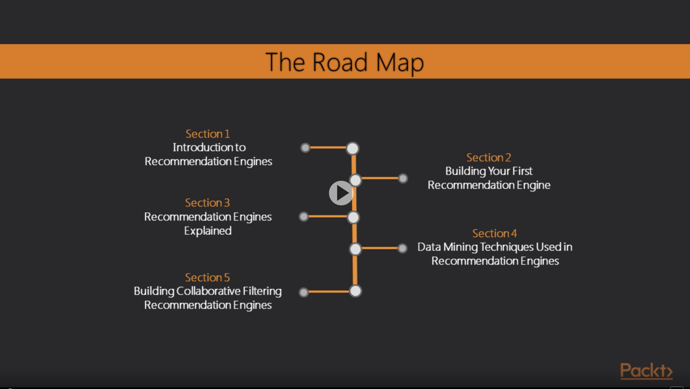
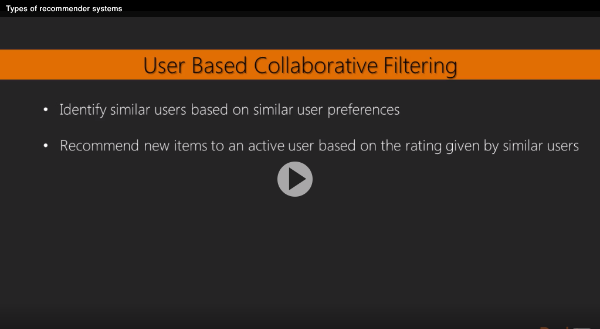
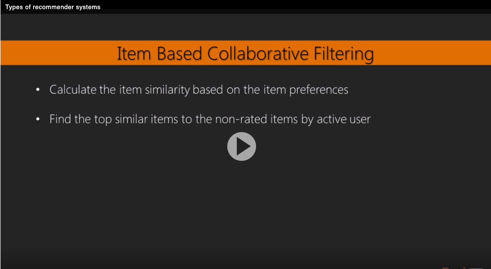
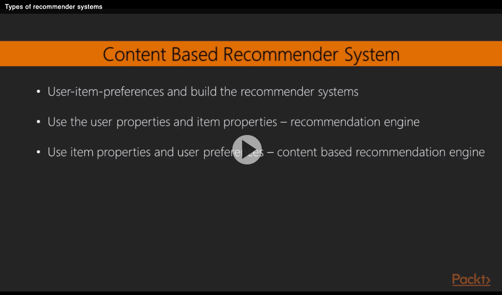
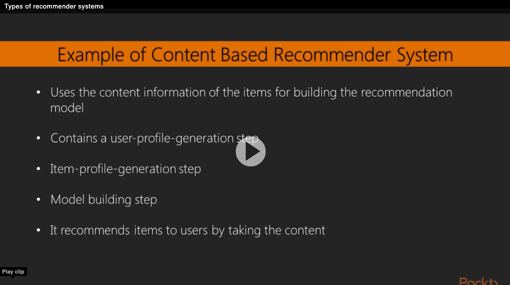

##This project is to create a recommendation system by following the course of [Course Link](https://learning.oreilly.com/videos/learning-path-build/9781788299633)

### Types of recommender systems
* Collaborative filtering recommender system
   * User-based
     
   * Item-based
     
* Content-based recommender system
  
  
* Hybrid and Context-aware recommender system

Test26